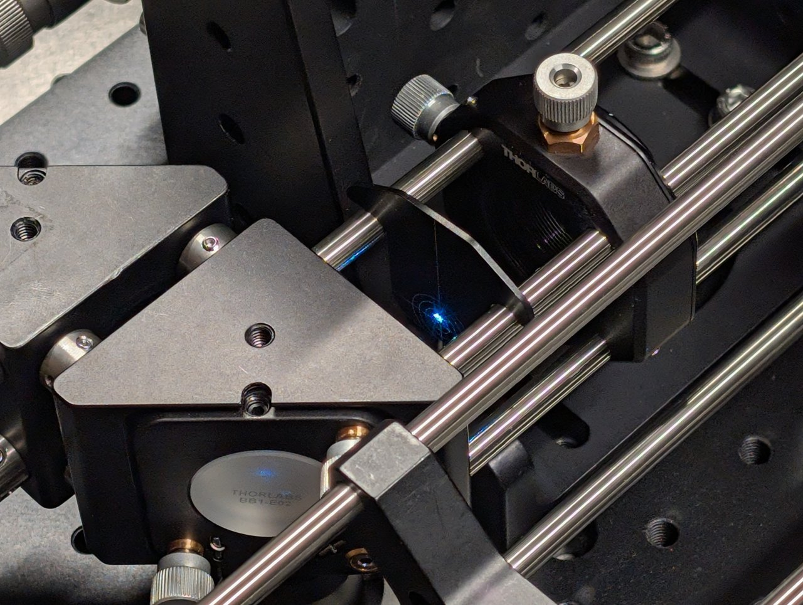
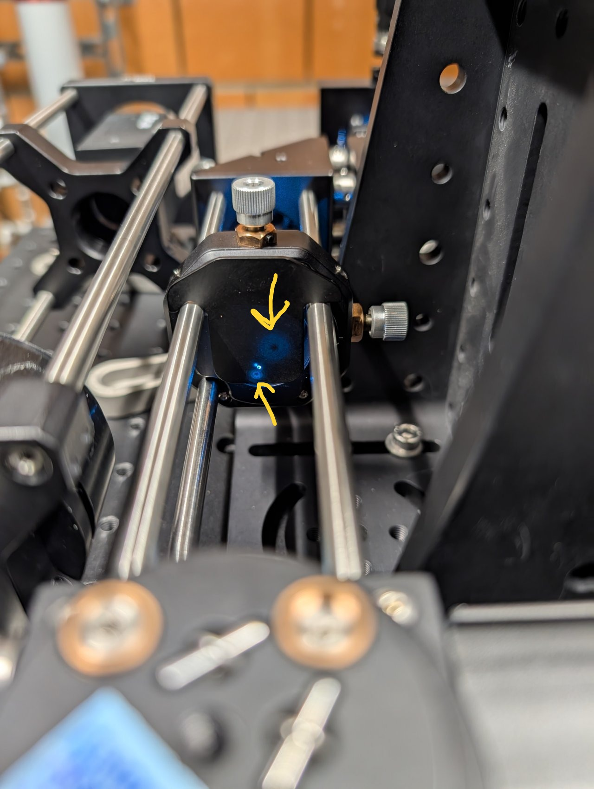
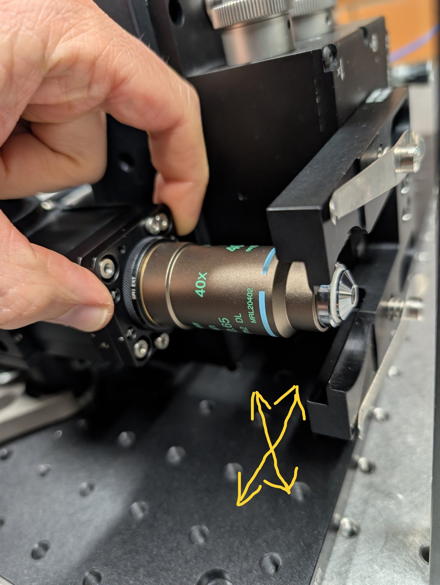
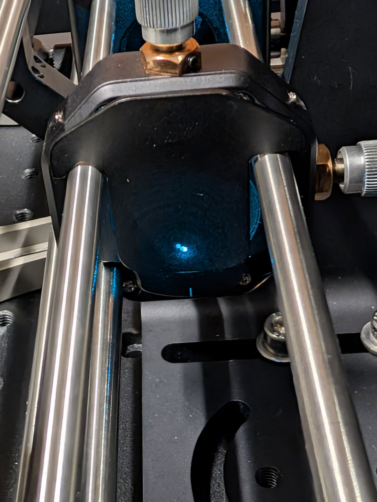
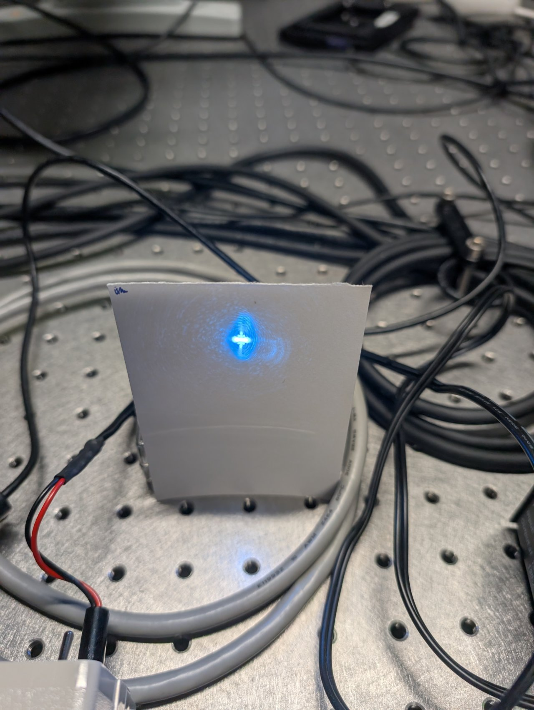
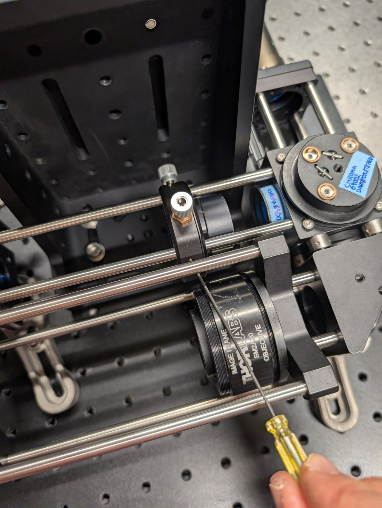
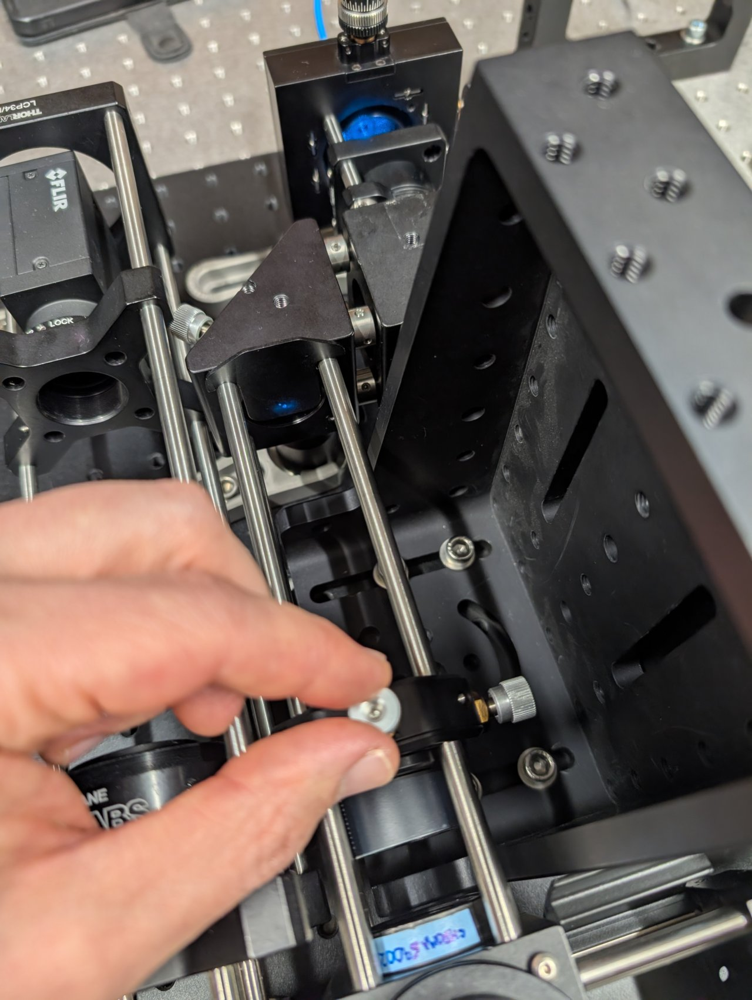

# Construct the Microscope Excitation Path

## Parts List

Below is the parts list for this section of the basic training course. Note that some of the parts used in the course are now obsolete. In these cases the parts listed below are the closest current match to the obsolete parts.

| Part | Manf. Part No. | Quantity | URL |
|------|----------------|----------|-----|
| f=45 mm, Ø1" Achromatic Doublet, SM1-Threaded Mount, ARC: 400-700 nm| AC254-045-A-ML | 1 | <https://www.thorlabs.com/thorproduct.cfm?partnumber=AC254-045-A-ML> |
| f=150 mm, Ø1" Achromatic Doublet, SM1-Threaded Mount, ARC: 400-700 nm | AC254-150-A-ML | 1 | <https://www.thorlabs.com/thorproduct.cfm?partnumber=AC254-150-A-ML> |
| Ø1" Broadband Dielectric Mirror, 400 - 750 nm | BB1-E02 | 2 | <https://www.thorlabs.com/thorproduct.cfm?partnumber=BB1-E02> |
| FC/PC Fiber Adapter Plate with External SM1 (1.035"-40) Threads, Narrow Key (2.0 mm) | SM1FC2 | 1 | <https://www.thorlabs.com/thorproduct.cfm?partnumber=SM1FC2> |
| XY Translator with Differential Drives, Metric | ST1XY-D/M | 1 | <https://www.thorlabs.com/thorproduct.cfm?partnumber=ST1XY-D/M> |
| Right-Angle Kinematic Mirror Mount with Tapped Cage Rod Holes, 30 mm Cage System and SM1 Compatible, M4 and M6 Mounting Holes | KCB1/M | 2 | <https://www.thorlabs.com/thorproduct.cfm?partnumber=KCB1/M> |
| 30 mm Cage System, XY Translating Lens Mount for Ø1" Optics | CXY1A | 1 | <https://www.thorlabs.com/thorproduct.cfm?partnumber=CXY1A> |
| 30 mm Cage System Iris Diaphragm (Ø0.8 - Ø20 mm) | CP20D | 1 | <https://www.thorlabs.com/thorproduct.cfm?partnumber=CP20D> |
| SM1-Threaded 30 mm Cage Plate, 0.35" Thick, 2 Retaining Rings, M4 Tap | CP33/M | 1 | <https://www.thorlabs.com/thorproduct.cfm?partnumber=CP33/M> |
| Rod Adapter for Ø6 mm ER Rods, L = 0.27" | ERSCB | 8 | <https://www.thorlabs.com/thorproduct.cfm?partnumber=ERSCB> |
| Cage Assembly Rod, 1/4" Long, Ø6 mm | ER025 | 4 | <https://www.thorlabs.com/thorproduct.cfm?partnumber=ER025> |
| Cage Assembly Rod, 2" Long, Ø6 mm | ER2 | 3 | <https://www.thorlabs.com/thorproduct.cfm?partnumber=ER2> |
| Cage Assembly Rod, 6" Long, Ø6 mm | ER6 | 3 | <https://www.thorlabs.com/thorproduct.cfm?partnumber=ER6> |
| Ø12.7 mm Optical Post, SS, M4 Setscrew, M6 Tap, L = 20 mm | TR20/M | 1 | <https://www.thorlabs.com/thorproduct.cfm?partnumber=TR20/M> |
| Ø12.7 mm Optical Post, SS, M4 Setscrew, M6 Tap, L = 30 mm | TR30/M | 2 | <https://www.thorlabs.com/thorproduct.cfm?partnumber=TR30/M> |
| Ø1/2" Post Holder, Spring-Loaded Hex-Locking Thumbscrew, L = 1" | PH1 | 2 | <https://www.thorlabs.com/thorproduct.cfm?partnumber=PH1> |
| Ø31.8 mm Studded Pedestal Base Adapter, M6 Threads | BE1/M | 2 | <https://www.thorlabs.com/thorproduct.cfm?partnumber=BE1/M> |
| Clamping Fork for Ø1.25" Pedestal Bases, 44.4 mm Counterbored Slot, M6 x 1.0 Captive Screw | CF175C/M | 2 | <https://www.thorlabs.com/thorproduct.cfm?partnumber=CF175C/M> |

*Not shown: shear plate, CPA1 alignment plates.*

## Instructions

### 0

Thread the FC/PC fiber adapter plate into the XY transaltion mount such that it is recessed as far as the barrel's internal amount will allow.

### 1

Attach three, 2" cage rods to the translation mount in the manner shown in the photos. Leave one cage rod hole open for the iris that will be installed in a later step.

### 2

Attach a 20 mm post to the bottom of the translation mount. Insert it into a post holder and attach a pedestal base.

### 3

Thread the 45 mm achromat into the cage plate. Ensure that the direction marked as \\( \infty \\) points away from the fiber adapter plate.

Slide this assembly onto the cage rods.

*Note the photo shows a CP02/M cage plate, but a CP33/M will work, too.*

### 4

Attach the assembly to an optical table.

### 5

Attach the fiber from the laser engine (provided to you) to the fiber adapter plate. Ensure that the key on the fiber connector aligns with the notch on fiber adapter plate.

### 6

Turn on the laser. Position a shear plate in front of the laser beam.

Move the f = 45 mm lens in front of the fiber until the fringes on the shear plate are approximately parallel to the guideline.

The first two images below show the fringe pattern with the lens too close and too far from the fiber. The third image shows the lens position with the fiber in the focal plane of the lens.

Tighten the set screws on the cage plate once the correct position is found to lock it into place.

### 7

Slide the iris onto the end of the cage rods.

### 8

Note the dot on the bottom of the right-angle kinematic mirror mount.

*We assume that there is a mirror already mounted inside the mount.*

### 9

Attach four cage rod adapters to the mirror mount.

*Metric cage rod adapters are shown, but imperial adapters work equally well.*

### 10

Attach four, 0.25" cage rods to the opposite side of the mirror mount.

*Three cage rods are shown because that was all that we had when this photo was taken.*

### 11

Attach cage rod adapters and the 30 mm post to the other right-angle kinematic mirror mount.

### 12

Attach a post holder with pedestal base to the mirror mount.

### 13

Attach one mirror mount to the other as shown using the cage rod adapters and 0.25" cage rods.

### 14

Attach the fiber output coupler assembly to the steering mirrors assembly by inserting the 2" cage rods into the other set of cage rod adapters.

### 15

Ensure that the assembly is level by checking the heights of the pedestals relative to the table. Adjust them if necessary.

### 16

Insert three, 6" cage rods into the other end of the steering mirror assembly as shown.

Slide the XY translating lens mount onto the cage rods **but do not tighten it yet.**

### 17

Slide the entire assembly into the cage rod holes in the dichroic cube, **taking care not to damage the dichroic inside the mount.** (It obstructs the cage rods from fully passing through the the cube.)

*Not shown:* Tighten the set screws that you can access with a hex driver.

### 18

Use two clamping forks to attach the excitation path assembly to the base plate.

### 19

Attach the fiber to the fiber adapter plate.

### 20

Close the iris.

### 21

Turn on the laser and observe where the beam hits an alignment plate

1. just before the excitation filter, and
1. just after the beam steering mirrors.

The transverse beam positions measured at opposite ends of the cage rods tells you the beam location direction in 3D space.

### 22

Align the laser beam to the center of the cage rods. Use the following procedure:

1. Place the alignment plate at the end of the excitation path, just before the excitation filter.
1. Turn the knobs on the kinematic mirror mount **that is closest to the excitation filter** until the beam is centered on the alignment plate.
1. Move the alignment plate to the opposite end of the cage rods, just after the second kinematic mirror mount.
1. Turn the knobs on **the first kinematic mirror mount** to center the beam on the alignment plate.
1. Go back to step 1 and repeat.

Repeat this procedure few times until the beam is centered on the alignment plate at both positions. The alignment should improve a little after each iteration.

### 23

Stop when the alignment no longer improves after an iteration.

### 24

Remove the cage plate covers before the objective.

Loosen the screws on the dichroic cube plate. Rotate the entire base plate and adjust the dichroic's pitch until the beam is roughly centered with respect to the cage rods. Use the alignment plates to determine the beam's centration.

It is likely that you will not be able to perfectly center the beam with respect to the cage rods because the cube plate does not have the degrees of freedom necessary for full alignment.

Tighten the screws once you come as close to centration with the cage rods as you can. 

### 25

Look at the back side of an alignment plate inserted into the 6" cage rods. Look for back reflections from the objective and excitation filter.

One reflection will come from the excitation filter. It will remain stationary as the dichroic is rotated or the objective is moved.

The other reflections should move with the dichroic or objective. These are from the back reflections from the internal surfaces of the objective.

### 26

To center the back reflections on the alignment plate, you must

1. rotate the dichroic, and
2. translate the objective using the slip plate.

The objective is well-aligned to the laser beam when the back reflections are centered on the incoming beam.

### 27

Thread the f = +150 mm achromatic lens into the XY translating lens mount. Ensure that the direction marked \\( \infty \\) is pointed towards the fiber.

### 28

Open the iris in front of the fiber output coupler.

### 29

Put an index card in front of the objective at a distance of about 1 meter or longer.

Slide the f = +150 mm lens along the cage rods until the beam size is minimized.

### 30

The beam will appear astigmatic due to reflection from the 1 mm thick dichroic. Try to find the lens position. where the beam size is smallest in each direction.

### 31

Tighten the set screws to lock the lens in place.

### 32

Stick an alignment plate into the cage system just after the second right-angle turning mirror and observe the back reflections from the f = +150 mm lens.

### 33

Adjust the lens's position until the back reflections are as centered as possible on the incoming beam.

### 34

Reinstall the cage system cover plates before the objective.

