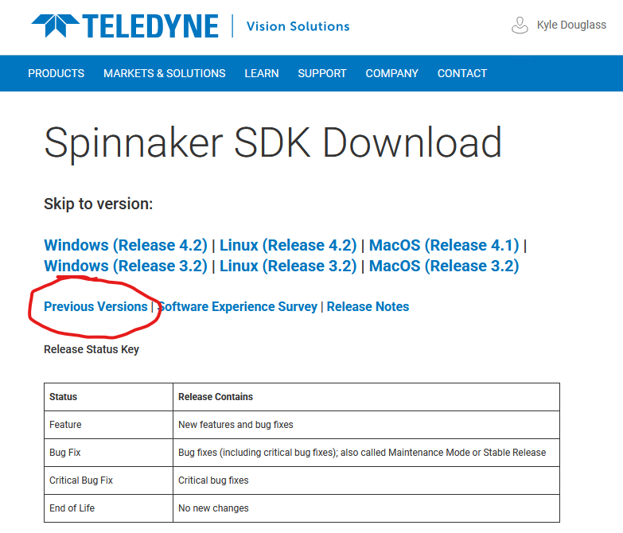
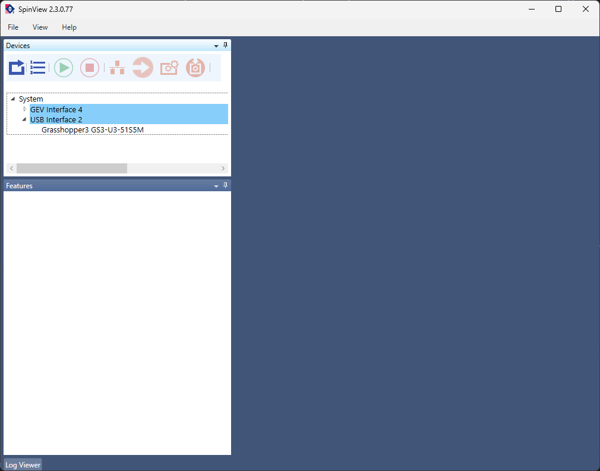

# Set up the Camera

We start construction of the microscope by installing the camera software and making sure that it works correctly.

The camera used in this course is a Flir Grasshopper GS3-U3-51S5M-C. It is one of several small form factor cameras that are often referred to as industrial CMOS cameras in the literature. Industrial CMOS cameras are relatively cheap and compatible with fluorescence microscopes, but their noise characteristics and sensitivities are worse than more expensive scientific CMOS, or sCMOS, cameras. While most of our research is done with sCMOS camers, industrial CMOS cameras are still sufficient for applications in basic fluorescence microscopy.

## Install the Drivers and Capture Software

To begin, we will install Flir's Spinnaker software that includes the necessary camera drivers and the SpinView capture software. **For reasons that will become apparent in a later section, you must install version 2.3.0.77.**

Navigate to [https://www.teledynevisionsolutions.com/products/spinnaker-sdk](https://www.teledynevisionsolutions.com/products/spinnaker-sdk) in your web browser and select the Download button. Product software pages change frequently, so if the page has changed since this was written, you will need to search for the Spinnaker SDK (software developer kit) and find it on your own.

You will be asked to create an account or sign in after clicking the Download button. Go ahead and do so.

Once logged in, you will see a page that looks like the following. Be sure to select the link for previous versions!

Download the **Windows version 2.3.0.77** installer. Unzip the file, and launch the installation with the `x64` version of the installer[^1]. When prompted, select `Applicaton development,` though `Camera evaluation` should work as well. There is no need to install the GigE camera driver[^2]. Any other settings may be left with their default values.

## Start Device Acquisition

After installation has finished, attach the camera to the PC with the blue USB cable and start the SpinView software. You will see a screen that looks like the following:

Confirm that the camera is recognized by the computer by finding it in the list of devices in the upper left panel of the screen. The camera used in this lab is a **Grasshopper3 GS3-U3-51S5M**. Select the camera in the list to enable its controls.

To acquire a live stream from the camera, click the green arrow at the top of the main image window. It should display the tooltip `Start device acquisition` when hovered over with the mouse. If all goes well, you should see a continuous stream of camera frames in the main window.

### Verify the Camera Works as Expected

You will not be able to see anything resembling a real image in the live stream. (Do you know why this is?) Regardless, we can do a few basic sanity checks to ensure that the camera works as expected. Try the following:

- Take the cap off of the camera and wave it in front of a light. Verify that you see changes in brightness in the feed at the same time.
- Try to change the exposure time, frame rate, and gain. (Changing the frame rate requires changing more than one setting in the SpinView software.)
- Change the size of the region-of-interest (ROI) acquired by the camera.
- Change the format of the pixels from 8 to 16 bits.

Once you are satisfied that you understand the camera's basic operation, we can move onto the next step.

[^1]: The `x64` version is for 64 bit operating systems. The `x86` version is for 32 bit operating systems. Nearly all modern computers used in the lab are 64 bit. The most relevant difference between the two is that 32 bit operating systems are limited to using only 4 GB of memory, while 64 bit systems currently have no practical limit. There is however a theoretical limit of about 16 exabytes.
[^2]: GigE is an interface standard for transmitting image data over ethernet.
