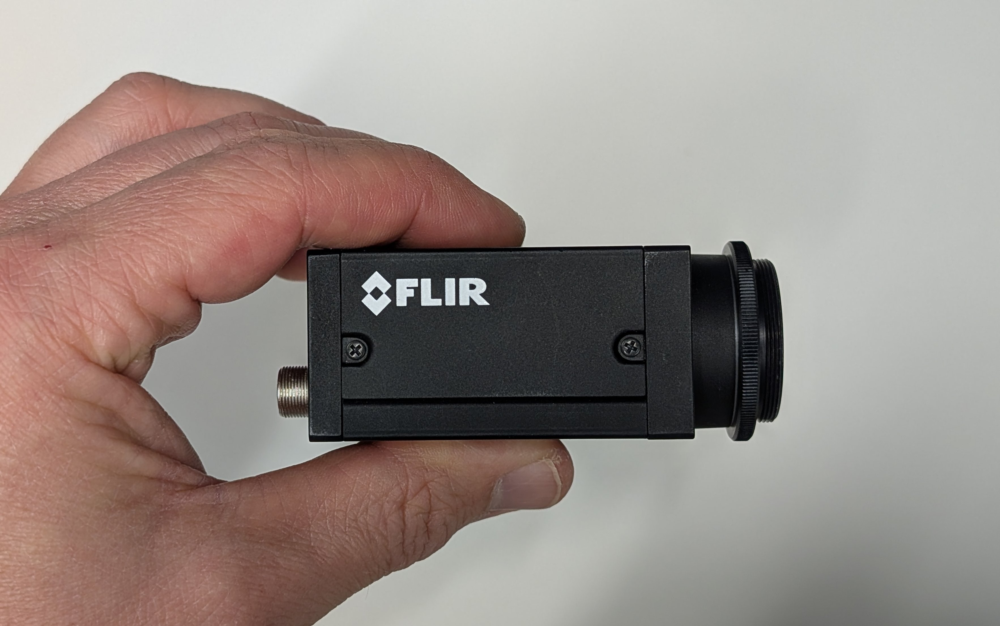

# Align the Camera and Tube Lens

In this section we build a fixed focal length camera that will serve as the base for building the rest of the microscope.

## Parts List

Below is the parts list for this section of the basic training course. Note that some of the parts used in the course are now obsolete. In these cases the parts listed below are the closest current match to the obsolete parts.

| Part | Manf. Part No. | Quantity | URL |
|------|----------------|----------|-----|
| Camera | Grasshopper3 GS3-U3-51S5M | 1 | <https://www.teledynevisionsolutions.com/en-150/products/grasshopper3-usb3/?model=GS3-U3-51S5M-C> |
| Camera USB Cable | | 1 | |
| Cage Assembly Rod, 10" Long, Ø6 mm | ER10 | 4 | <https://www.thorlabs.com/thorproduct.cfm?partnumber=ER10> |
| 30 mm to 60 mm Cage Adapter, 0.5" Thick | LCP33/M | 2 | <https://www.thorlabs.com/thorproduct.cfm?partnumber=LCP33/M> |
| Adapter with External SM1 Threads and Internal SM2 Threads | SM1A2 | 1 | <https://www.thorlabs.com/thorproduct.cfm?partnumber=SM1A2> |
| Tube Lens, f = 200 mm, ARC: 350 - 700 nm, External M38 x 0.5 Threads | TTL200 | 1 | <https://www.thorlabs.com/thorproduct.cfm?partnumber=TTL200> |
| Adapter with External SM2 Threads and Internal M38 x 0.5 Threads | SM2A20 | 1 | <https://www.thorlabs.com/thorproduct.cfm?partnumber=SM2A20> |
| 60 mm Cage Plate, SM2 Threads, 0.5" Thick, M4 Tap | LCP34/M | 1 | <https://www.thorlabs.com/thorproduct.cfm?partnumber=LCP34/M> |
| SM1 Quick-Release Adapter Set | SM1QA | 1 | <https://www.thorlabs.com/thorproduct.cfm?partnumber=SM1QA> |
| Adapter with External C-Mount Threads and External SM1 Threads, 3.2 mm Spacer | SM1A39 | 1 |<https://www.thorlabs.com/thorproduct.cfm?partnumber=SM1A39> |

In addition, you will need 2 mm and 0.05" Allen screwdrivers.

## Instructions

### 0

Remove the protective cap from the camera.

### 1

Attach the C-mount to SM1 external threads adapter to the camera.

### 2

Attach the SM1 quick-release adapter set to the camera.

### 3

Attach one 30 mm to 60 mm cage adapter to the other end of the quick-release adapter via the SM1 threaded hole.

### 4

Use a 0.05" hex driver to loosen the set screw on the quick-release adapter set. Rotate the camera until its body is aligned with the cage rod holes in the 30 mm to 60 mm cage adapter.

### 5

Loosen one of the set screws on the outer set of holes for the cage rods using a 0.05" hex driver. Insert a cage rod and tighten the screw.

Repeat for all four cage rods.

For the older 30 mm to 60 mm cage adapters with 0.05" set screws, it is OK if one of the two screws is missing.

### 6

Thread the 200 mm tube lens into the SM2A20 tube lens holder if it is not already. Attach an externally threaded SM1 to interally threaded SM2 adapter to the tube lens holder on the side facing the objective.

### 7

Thread a 30 mm to 60 mm cage adapter onto the external SM1 threads of assembly from the previous step.

### 8

Slide the assembly from the previous step onto the other end of the cage rods and tighten the set screws so that the assembly does not slide along the rods.

### 9

Plug in the camera and launch the SpinView software installed in the [previous page](./camera.md). Take the lens assembly and PC to a room with a window with a view of far away objects, e.g. clouds or mountains. Start a live image feed and adjust the settings so that the image is not saturated.

One example for how to do this is illustrated below. It is not the only way.

### 10

At the beginning, you will likely see an out-of-focus image like the one below.

Loosen the set screws of the camera. Carefully adjust the position of the camera along the cage rods until an in focus image is formed.

Depending on the lighting conditions, the image may not have good contrast. This does not matter. Just make the far away object in focus by finding the correct position of the camera.

Tighten the set screws once the image is in focus.

### 11

Attach the cage plate to the end of the cage rods. This will be used to mount the camera/tube lens assembly to the optical table in a later chapter.

You should now have a fully assembled, fixed focal length camera system.

