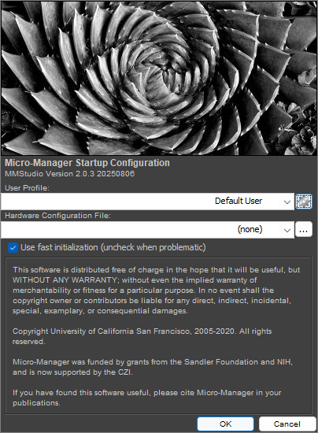
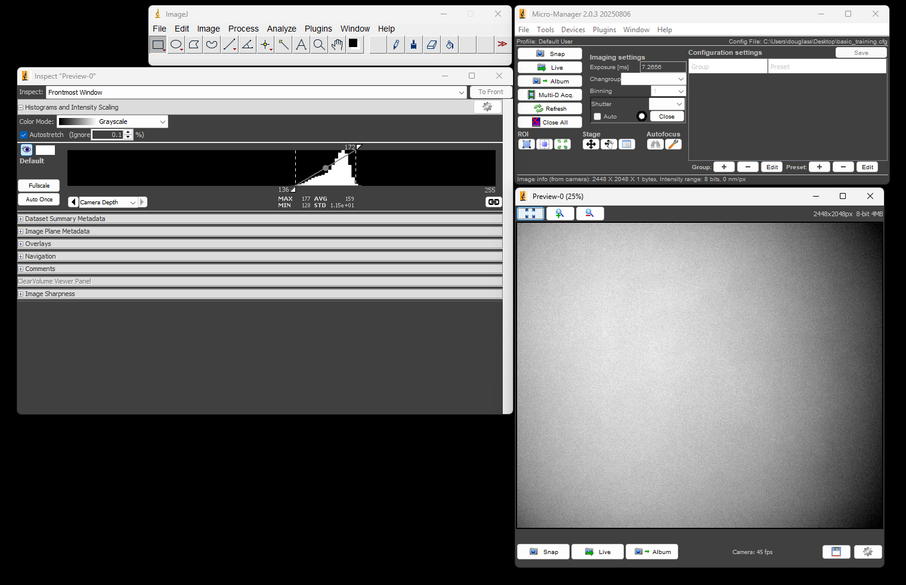

# Set up Micro-Manager

[Micro-Manager](https://micro-manager.org/) is open source software for microscope control and automation. It allows you to control and coordinate many types of hardware from different vendors, often with little-to-no additional work.

As an ImageJ plugin, it also gives you image analysis capabilities on data as it is acquired far beyond what any camera manufacturer's software allows.

We use Micro-Manager on several of our laboratory instruments. A basic understanding of how to use Micro-Manager is therefore essential to successful operation of these microscopes.

## Download and Install the Latest Nightly Version

Micro-Manager comes in both stable and so-called "nightly" versions[^1]. You will want to use the latest nightly version because it contains all the latest features and bug fixes.

Navigate to <https://micro-manager.org/> and select the hamburger menu, then `Downloads > Nightly Builds`. Select `Version 2.0 (Windows)` and click the link to the most recent executable file, which should be at the top of the list.

Once the file is downloaded, run the installer and select all the default options.

## Run Micro-Manager

Launch Micro-Manager. Its startup screen will look something like the following:

Select the `MMConfig_demo` configuration and select `OK`. You will have two windows open: the first is the ImageJ control panel. The second is the Micro-Manager control panel, as shown below:

When you click the `Live` button, you should see a live image stream from the demo camera, which simulates a real camera by displaying a moving sine wave. You will alse see the image inspector window, which provides realtime information on the image's histogram, bit depth, and other information.

Play with some of the settings in this window to get a feel for what you can do.

## Micro-Manager Concepts

In order to use Micro-Manager at a basic level, it is important to understand the following concepts.

### Device

A device is any piece of hardware that Micro-Manager controls. It could be a light source, a camera, a microscope stage, a filter wheel, a shutter, etc.

### Device Properties

A device is akin to a state machine. The set of all its properties and their values make up the device's state.

For example, a camera might have an exposure time property and a bit-depth property. A laser might have an output power property.

Some properties may be changed by the user, whereas others are read only. An example of a read only property would be a temperature sensor.

To see a list of all the device properties for all the currently configured devices, navigate to `Devices > Device Property Browser...`. You may also modify properties in this window.

The device property browser for the MMDemo configuration is shown below.

### Device Adapter

Device adapters are what make Micro-Manager so powerful. A device adapter is a plugin for a device that allows it to work with Micro-Manager.

A device adapter must exist for a device to be used with Micro-Manager. If one does not exist, you can write one using the C++ programming language to make it work with Micro-Manager. Writing device adapters is outside the scope of this basic training course, however.

You may find a partial list of supported devices [at the Micro-Manager website](https://micro-manager.org/Device_Support).

### Configuration

The configuration is the set of all devices to be controlled by Micro-Manager, as well as additional settings like desired default values.

Configurations allow you to select hardware and settings for different experiments.

In the following section, we will configure Micro-Manager to control the Flir camera for our microscope.

## Create a New Configuration

### 0

Close Micro-Manager if it is already open.

Connect the camera to your PC and launch Micro-Manager. Select `(none)` for the `Hardware Configuration File` and click `Ok`.

### 1

In the Micro-Manager control panel, navigate to `Devices` > `Hardware Configuration Wizard...`. Select `Create new configuration` and click `Next >`.

### 2

In the next window, scroll down the list of available devices until you find the device called `SpinnakerCamera`. Expand the item to find our Grasshopper camera. Select it, and click `Add...` and then `OK`. Click`Next >` through the remaining windows. At the end, save the configuration file somewhere that makes sense.

#### Troubleshooting

Can't see a device called SpinnakerCamera? The Grasshopper camera does not appear in the list? Do you receive an error immediately after creating the configuration? Try the following things to troubleshoot.

1. Restart Micro-Manager. Devices need to be plugged in **before** Micro-Manager starts for them to be recognized.
1. Ensure that you installed the correct version of the Spinnaker SDK during [the camera setup](./camera.md).
1. Be sure that the camera is recognized by SpinView. In general, if a device can't be used by its manufacturer's software, then it will not work in Micro-Manager.

### 3

Once back at the Micro-Manager control panel, click the `Live` button. You should see a live image stream in the preview window and the image inspector showing a histogram of the pixel values.

At this point you have configured Micro-Manager to control the camera. Feel free to play with settings such as the exposure time, or go into the Device Property Browser to see what camera properties can be modified.

[^1]: A new nightly version is created at the end of any day where the source code changes. It's called "nightly" because it used to be built once a day, regardless of whether the source code changed.
