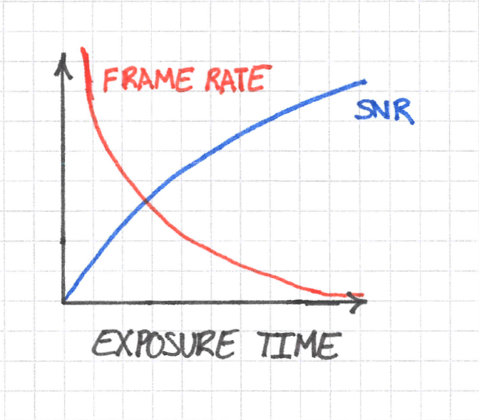
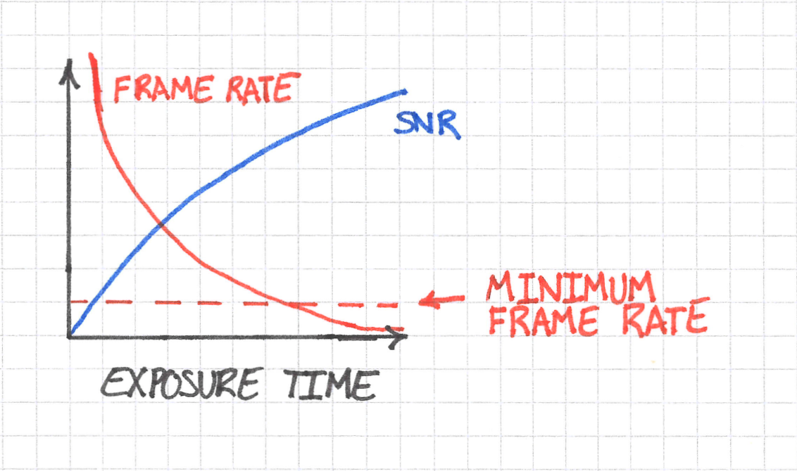
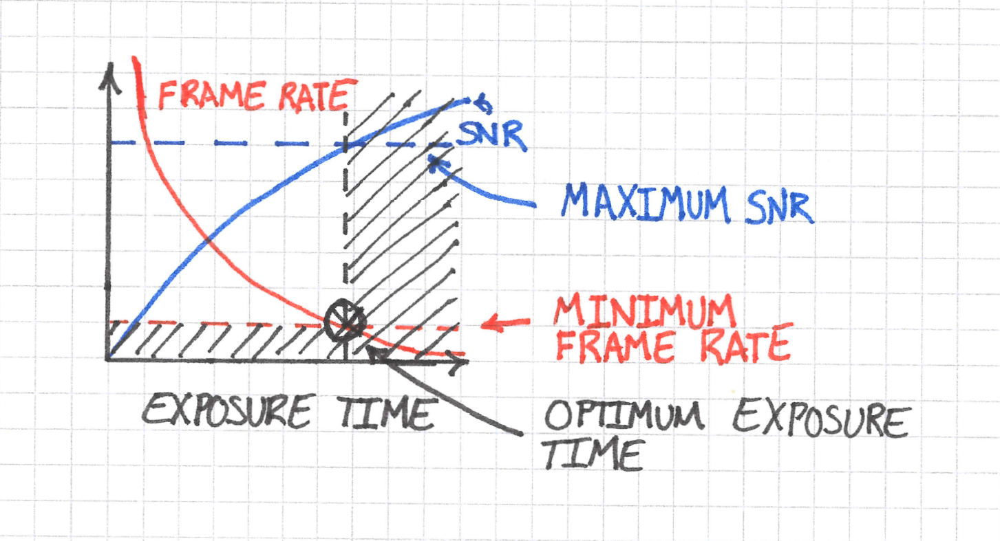

# Discussion

## Imaging Parameters Optimization

If all you wanted to do was to maximize the signal-to-noise ratio (SNR) of your images, then you would increase the exposure time and/or light intensity until the histogram was as far to the right of its range as possible without saturating any pixels.

But what if the intensity is maxed out and you still have room left in the histogram to improve the SNR? You could increase the exposure time still further. But, as a result, doing so would decrease your frame rate. If you also needed to image fast dynamics within the cell, then there would be an upper limit to the value for the exposure time that you can set. Beyond this value, you would not have a high enough frame rate to see the thing that you would like to see; it would be blurred out.

Ultimately this means that you must sacrifice some SNR to obtain a sufficient temporal resolution. We can visualize the problem like this:

Do not worry too much about the exact shapes of the curves in the sketch above; what's important are the trends. SNR increases with exposure time, whereas frame rate decreases. The dynamics that you want to see set a requirement on the minmimum frame rate at which you can image. You can imagine this minimum as follows:

But the minimum frame rate imposes a maximum on the exposure time. This value is just the vertical line through the point of intersection of the frame rate curve and its minimum required value.

Taking this logic one step further, the maximum exposure time also imposes a maximum achieveable SNR, so in the end we have something like this:

The frame rate requirement ends up reducing the parameter space of exposure time and, subsequently, the maximum achieveable SNR.

We have finally arrived at an optimization problem: given the frame rate requirement, what exposure time maximizes SNR?

The answer in this case is easy: it's the exposure time that corresponds to the value where the frame rate is *just* fast enough to see the dynamics that you are after.

You can of course image at shorter exposure times, but then your SNR will suffer, and there is never a benefit to having images with less SNR.

### What Parameter Values should I choose?

So we know that, in the example above, you can't make the exposure time too large and as a result you will sacrifice some SNR. So what value for the exposure time should you choose?

The answer is: it depends.

Microscopy experiments that are performed to ad
