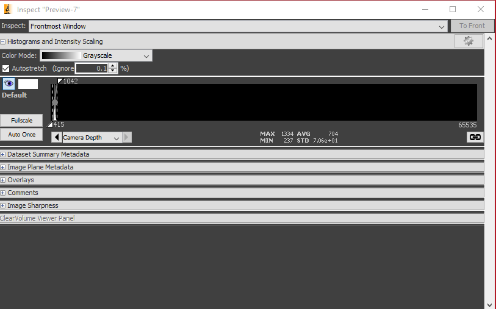

# Image the Cells in Fluorescence

This section assumes that the you have performed the steps in the last two sections. Most importantly, you have found the cells and they are in focus.

We will perform fluorescence imaging of mitochondria in this section. The cells have been modified to express [StayGold fluorescent protein](https://www.fpbase.org/protein/staygold/) that is targeting the mitochondrial matrix. No staining is necessary.

## Instructions

### Step 0

In the `Configuration Settings` section of the Micro-Manager control panel, set the `Channel` to `GFP (470 nm)`.

It's OK to leave the `Transmitted Light Intensity` at a non-zero value because the transillumination lamp will not turn on when the GFP channel is active.

Adjust the `470 nm Intensity` to some non-zero value.

### Step 1

Click `Live`. You should see:

1. a fluorescence image of the mitochondria in the `Live` panel, and
2. blue light coming from the objective. (There is no need to look directly over top the sample; you should not do this anyway for eye safety reasons.)

### Step 2

Check the Image Inspector window, which displays a histogram of all the pixel values.

In the example below, you can see that the histogram lies near the bottom of the range of pixel values (0 - 65535). The minimum is 237 analog-to-digital units (ADU) and the maximum is 1334 ADU, with an average of 704 ADU.

### Step 3

Increase either the exposure time or the LED intensity. You should see the histogram shift to the right like below.

The live image should appear less noisy as well, which corresponds to it having higher signal-to-noise ratio (SNR).

Try to adjust the intensity and the exposure time until the histogram is as far to the right of the range as possible **without saturating any pixels**.

### Step 4

Select the `Multi-D Acq.` button in the Micro-Manager control panel. This will open the Multi-Dimensional Acquisition window as shown below.

### Step 5: Take a Time-Series Acquisition

Ensure that `Time Points` is checked and that `Multiple Positions`, `Z-Stacks`, and `Channels` are unchecked. Set the count to 100 and the interval to zero. (Image as fast as possible.)

For the directory root, select `D:\DATA_Zeiss\<your name>\<YYYYMMDD_experiment_name>`. For the name prefix, enter something short and descriptive, such as `U2OS_Staygold`.

Ensure that `Image stack file` is selected, and enter any additional metadata you wish to save in the `Acquistion Comments`.

Click `Acquire!`

You can review the images after they have been acquired.

### Step 6: Z-Stack Acquisition

Find a suitable focal plane for your cells to serve as the center slice of the Z-stack.

In the Multi-D. Acquisition window, ensure that `Z-Stacks (Slices)` is checked and that `Time Points`, `Multiple Positions`, and `Channels` are unchecked.

Check the `Keep Shutter Open` checkbox to avoid rapidly turning the light on and off during the acquisition. Set the `Start Z` and `End Z` values to `-1` and `1`, respectively. Set the `Step size` to 0.1.

You can keep the directory root and prefix values the same as before. Micro-Manager will append a number to the end of the folder to ensure that any existing data is not overwritten.

Click `Acquire` to launch the acquisition.

### Step 7:

When you have finished, you may close Micro-Manager. The hardware is turned off in the reverse order that it was turned on.

### Step 8:

Push back the condenser tower. Remove the sample and insert from the stage. Clean the objective with lens cleaning tissue and ethanol as instructed.
