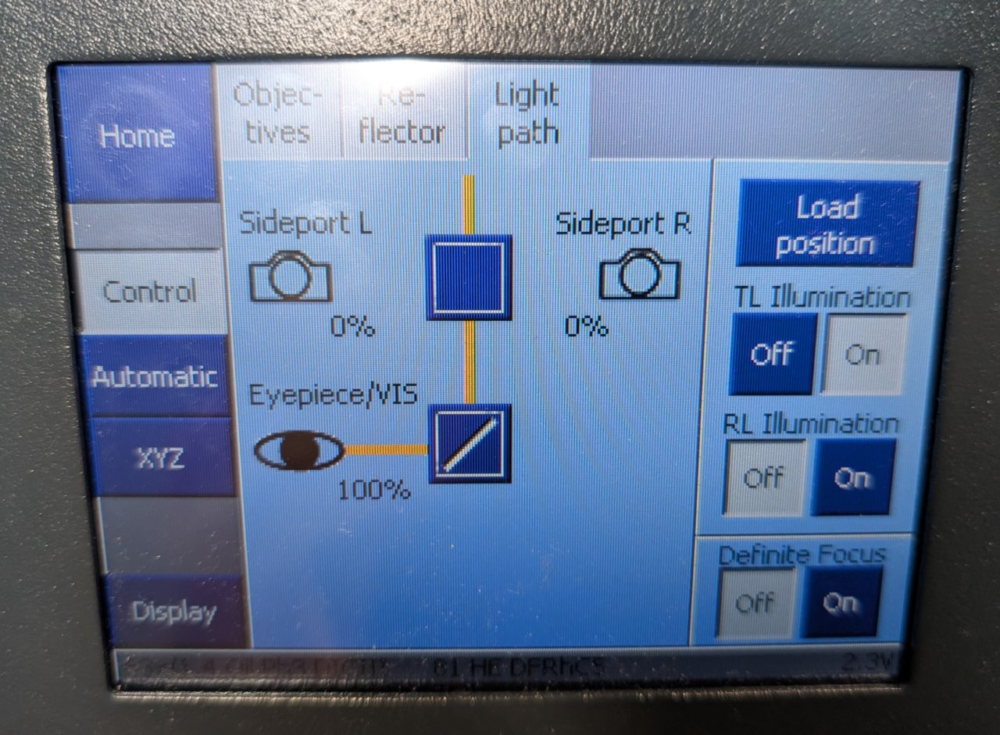
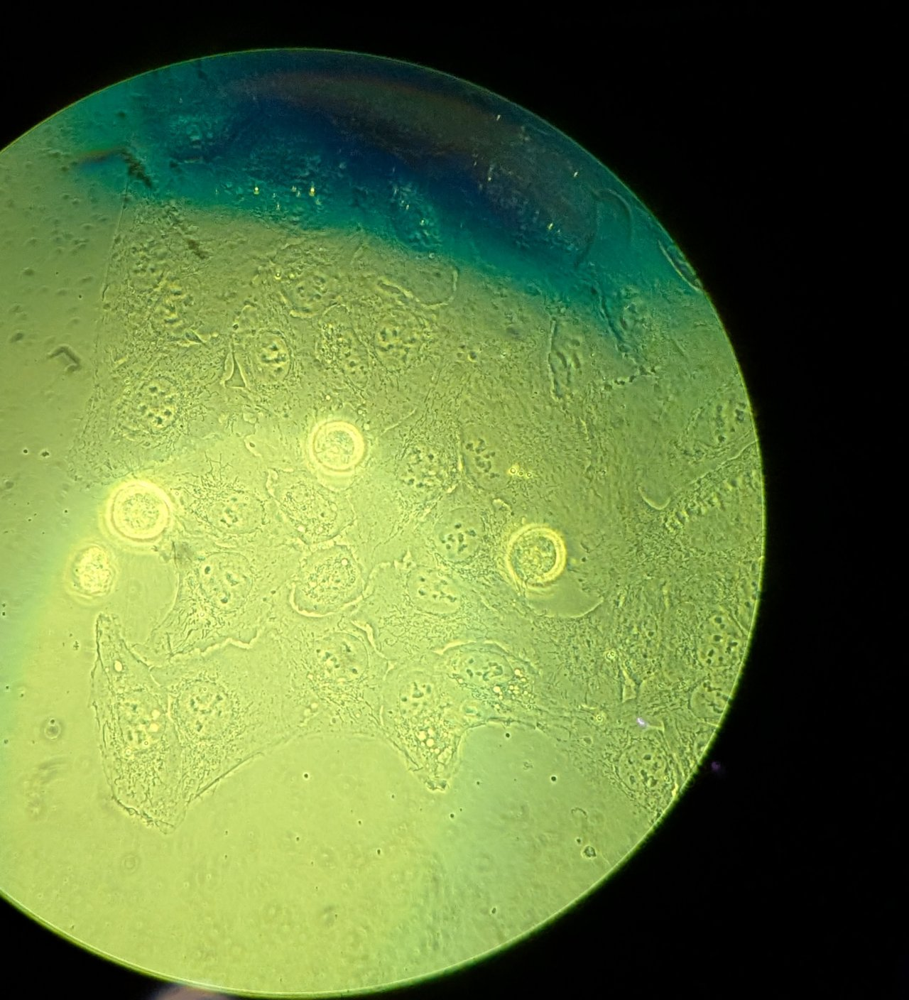
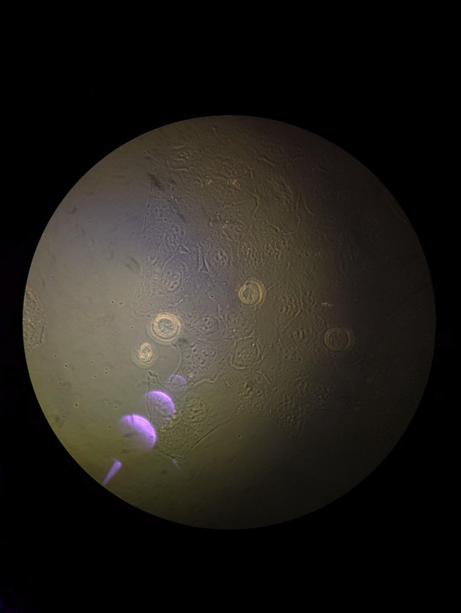

# Set up Köhler Illumination

This section assumes that the microscope is on and your sample is on the stage.

We will align the condenser tower so that the sample is illuminated with Köhler illumination. Köhler illumination refers to a specific configuration of the transillumination optics that ensures:

1. homogeneous illumination
2. field-independent image quality

In addition, we will ensure good alignment for phase contrast imaging.

## Instructions

### Step 0

Under the `Light Path` tab of the Zeiss control panel, switch the light path from sideport to eyepiece.

### Step 1

Open the field stop of the condenser until it is full open.

### Step 2

Adjust the illumination intensity. Turn the focus knobs on the microscope until the sample is brought into focus.

**Do not proceed to the next step until you are focused on the sample.**

*Tip:* Depending on their confluency, you may need to translate the stage to find an area containing cells.

If you are having trouble focusing, trying translating the sample and looking for changes in the field of view first. You can tell if cells are there even if they are out-of-focus.

### Step 3

Close down the field stop unitl it is fully closed. You will see something similar to the following in the eyepiece.

### Step 4

**Be careful in this step not to drive the condenser into the glass on the CO2 chamber!**

Slowly adjust the height of the condenser until it is just above the glass on the CO2 chamber. Bring the edges of the field stop into focus using the height adjustment. You may need to switch between adjusting the height and adjusting the XY position of the condenser using the adjustment screws to find the edges.

Be patient; this part takes some time and practice.

Once the field stop is in focus, center it.

### Step 5

Return the condenser tower to its original, upright position.

Set the microscope back to the side port light path and proceed to the next section.

