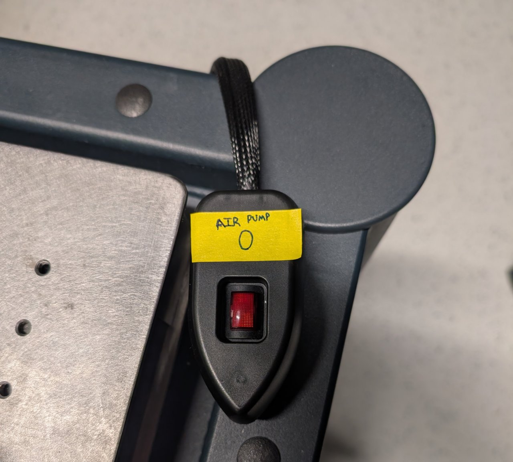
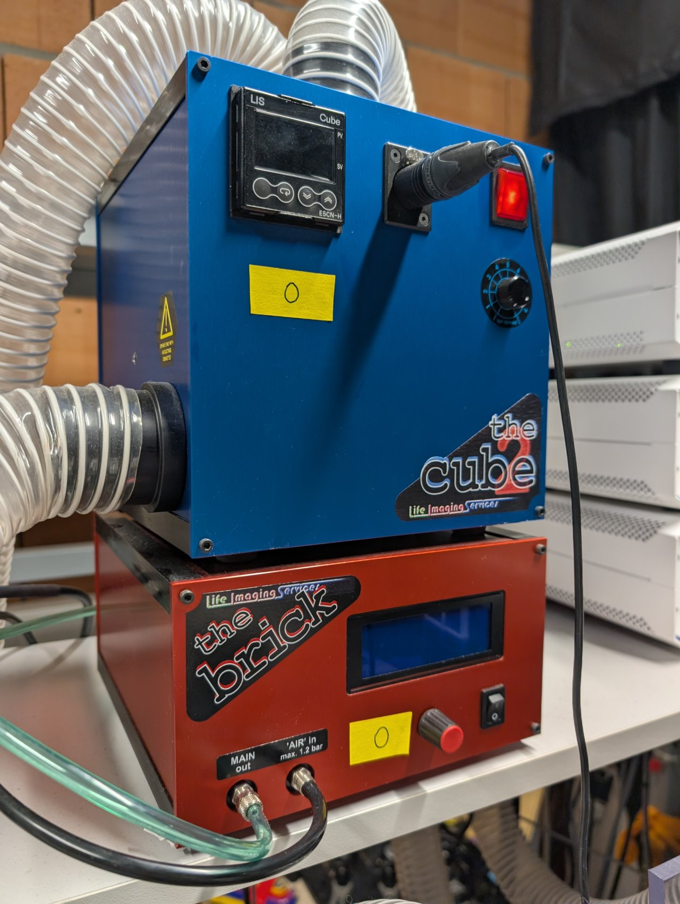
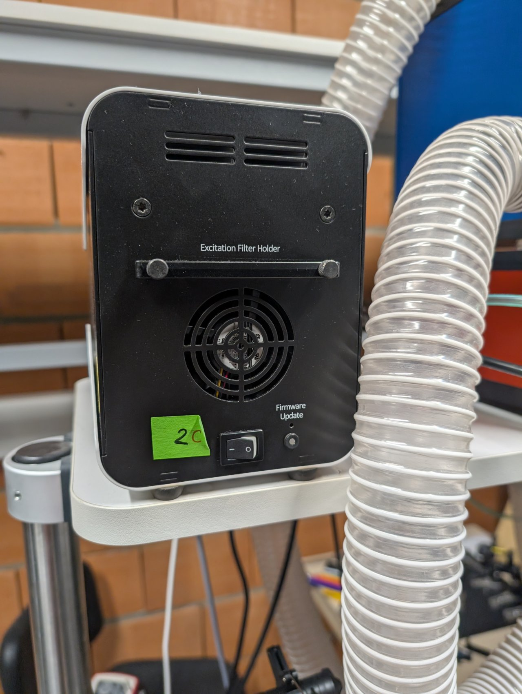
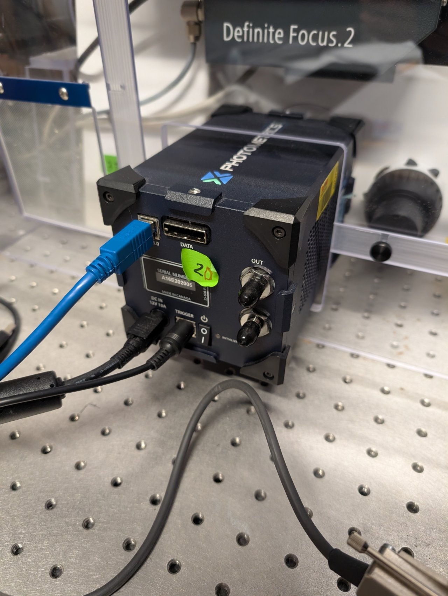
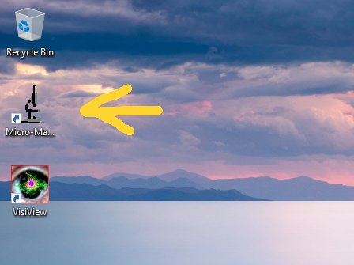
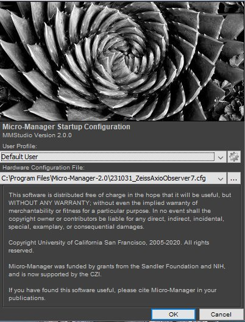
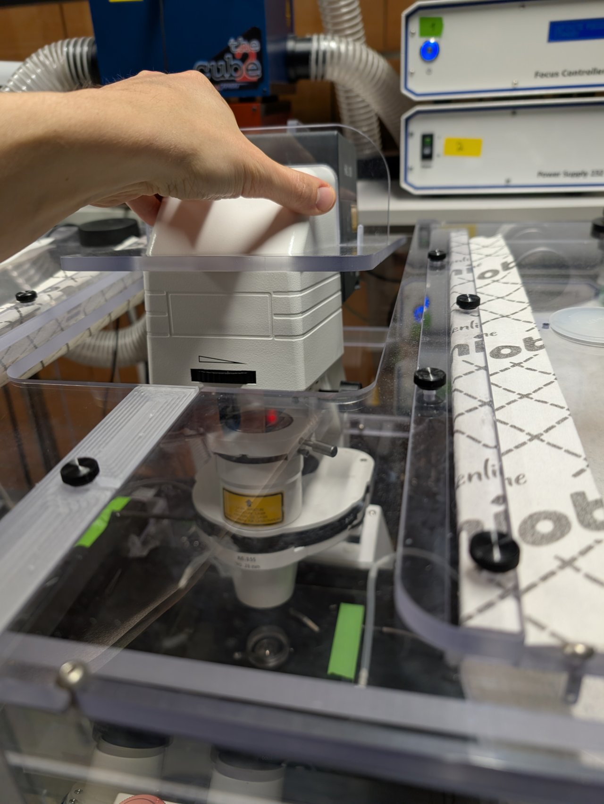
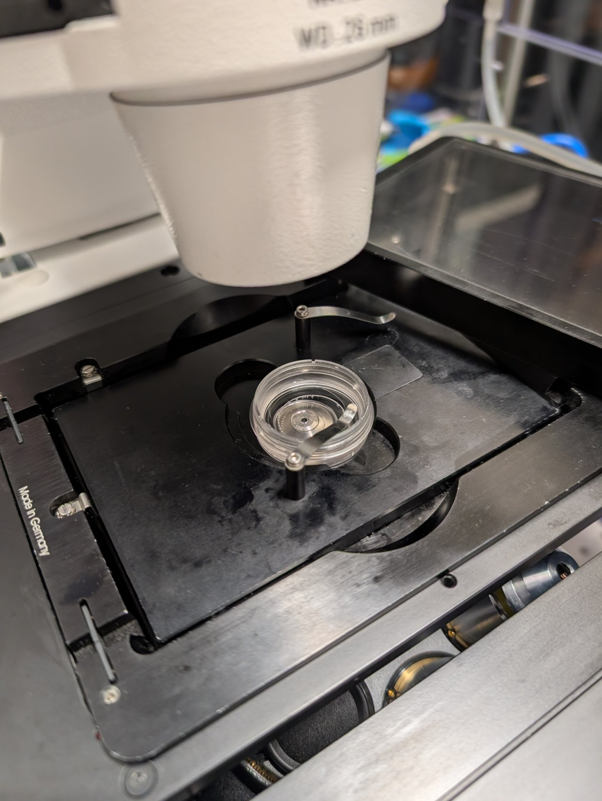

# Microscope Startup

We will begin by starting up the microscope and its components.

## Instructions

### Step 0

Turn on the air pump and the environmental controls for the incubator.

It is good practice to turn these on 10 minutes or more before any experiment so that the environmental controls have a chance to stabilize.

### Step 1

Turn on the focus controller for the Zeiss's Definite Focus system.

In addition, turn on the Zeiss's Power Supply 232 and SMC 2009 controllers.

### Step 2

Turn on the CoolLED unit.

### Step 3

Turn on the camera. You need not wait for the initialization to finish before turning on the control PC because the camera is connected via USB.

### Step 4

Wait until the Definite Focus controller's initialization has finished. (You can tell whether it has finished because it will no longer display a message indicating that it is initializing on its LCD display screen.)

Turn on the microscope.

### Step 5

Log into the computer with your EPFL username.

Find the shortcut to Micro-Manager on the desktop and double click it.

*2025-12-05*: This shortcut should point to `C:\Program Files\Micro-Manager-2.0\ImageJ.exe`. It is a slightly out-of-date version of Micro-Manager that is intended to support the CoolLED light source.

### Step 6

After a few seconds or less You will see the Micro-Manager startup screen. Ensure that the `231031_ZeissAxioObserver7.cfg` configuration file is selected. We have placed it inside the Micro-Manager folder in case you must select it yourself.

Click `OK` to continue.

### Step 7

After a few more seconds, you will see the Micro-Manager control panel. If you do not see all the configuration settings at first, then expand the window by dragging its border.

### Step 8

You can set the channel and objective by selecting the corresponding configuration settings in the control panel.

### Step 9

Click the `Live` button. If you see a noisy image stream appear, then you are ready to proceed to the next steps.

### Step 10

Push back the condenser tower. It is a bit difficult and does not rotate easily.

### Step 11

**Make sure that you are using the 63x oil immersion objective.** If not, use the control panel to switch to it.

Add a small drop of 37 C immersion oil to the lens, and put your sample in the solid bottom plate. Put the plate into the opening in the microscope stage.

Secure the sample dish with a metal clip.

### Step 12

Cover the sample dish with the CO2 chamber.

